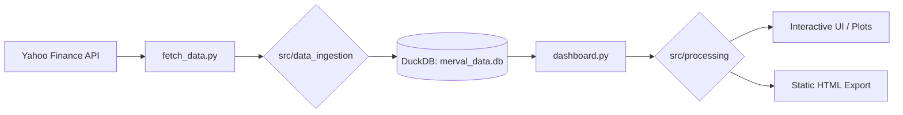

# Argentine Fintech Screener 🇦🇷

[](https://www.python.org/)
[](https://pola.rs/)
[](https://duckdb.org/)
[](https://marimo.io/)

Hi! Thanks for stopping by my portfolio. I'm currently a student learning **Data Engineering**, and I built this project to practice processing real financial data and building high-performance interactive apps from scratch.

This project analyzes the extreme volatility of the Argentine market (MERVAL index, ADRs, and implicit FX rates) using the **Modern Data Stack 2026**.

## 🚀 Why the Argentine Market?

When learning **Time Series analysis** and **Anomaly Detection**, you need data that actually moves. I chose the Argentine market because its extreme volatility, high inflation, and sudden political shocks make it a world-class laboratory for data science.

Instead of looking at a flat chart, tracking the Argentine market during election cycles shows you exactly what a massive economic swing looks like in the data.

### 🔬 Digital Signal Processing (DSP) Implementation
I implemented a **Savitzky-Golay low-pass filter** to calculate a **Signal-to-Noise Ratio (SNR)**. This allows the tool to mathematically distinguish whether an asset is moving due to underlying **Market Trends** (the core signal) or purely due to short-term **Political Noise** and panic.

## 🛠️ The 2026 Modern Data Stack

While I have mastery over traditional tools like Pandas and SQLite, I deliberately chose these technologies to push the boundaries of performance and developer experience:

*   **Polars**: Used for lightning-fast data pipelines and vectorized operations. I optimized event matching using `join_asof` for high-performance temporal joins.
*   **DuckDB**: Serving as the local analytical engine, allowing complex SQL queries without the overhead of a traditional server.
*   **Marimo**: A reactive notebook system used to build an interactive UI that behaves like a modern web app.

## 🏗️ Project Architecture



## 📸 Showcase & Demos

### Interactive Dashboard

*Note: This dashboard allows filtering by political events and visualizing denoised trends.*

### Market SNR Table

*Assets with lower SNR ratios indicate higher sensitivity to political "noise".*

## 🚦 Getting Started

### Prerequisites
- Python 3.10 or higher.

### 1. Environment Setup
```bash
# Clone the repository
git clone https://github.com/your-username/argentinian-markets.git
cd argentinian-markets

# Create and activate virtual environment
python -m venv .venv
source .venv/bin/activate  # On Windows: .venv\Scripts\activate

# Install dependencies
pip install -r requirements.txt
```

### 2. Data Ingestion
Populate the local DuckDB database with the latest 3 years of market data:
```bash
python fetch_data.py
```

### 3. Run the Dashboard
Launch the interactive Marimo server:
```bash
python -m marimo edit dashboard.py
```

## 📄 Viewing Without Running
If you just want to see the results without installing anything, check the **[static dashboard export](dashboard.html)** (coming soon) or browse the screenshots in the `assets/` folder.

---

*This project is part of my path towards becoming a Senior Data Engineer. Feel free to reach out for feedback or collaboration!*
